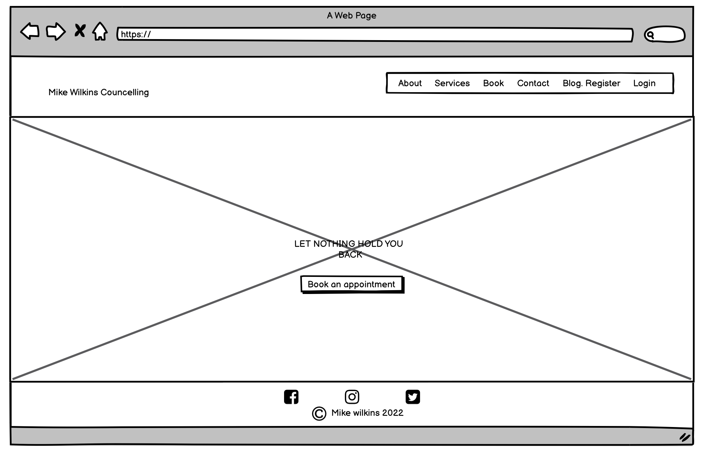
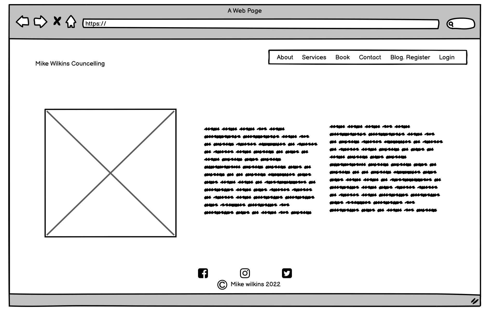
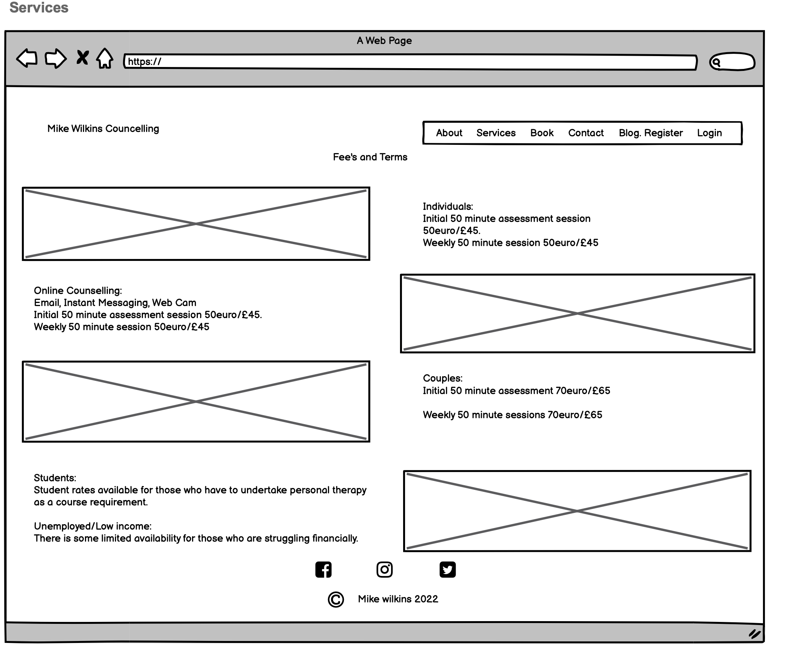
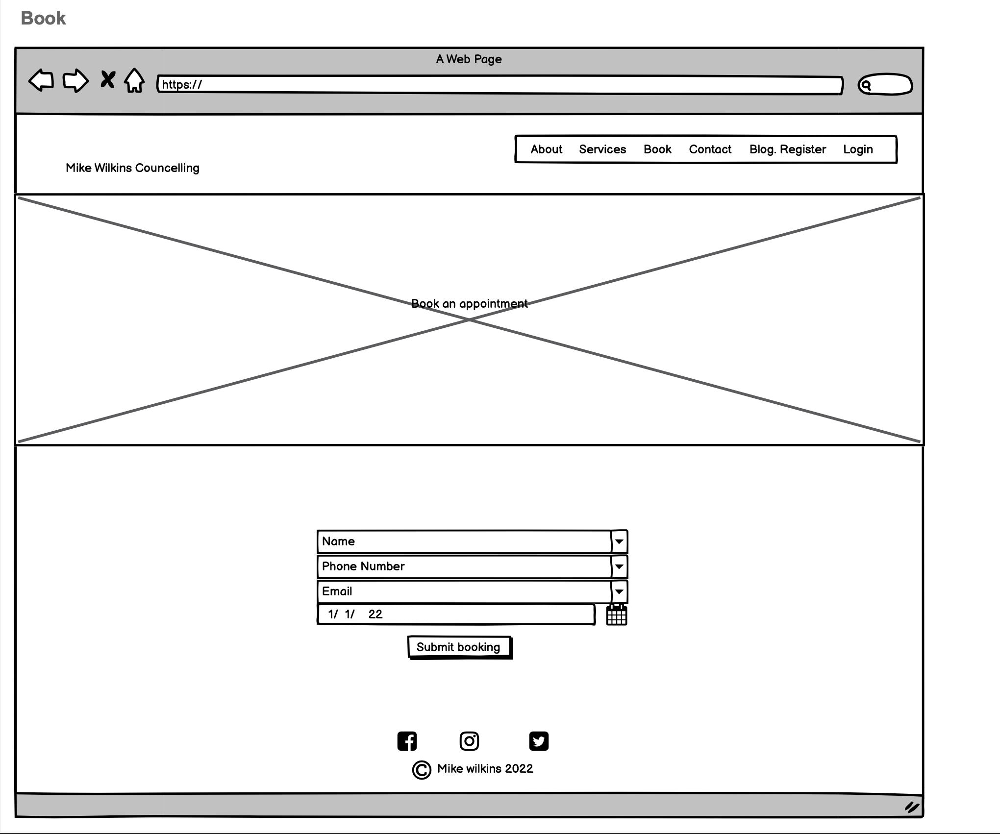
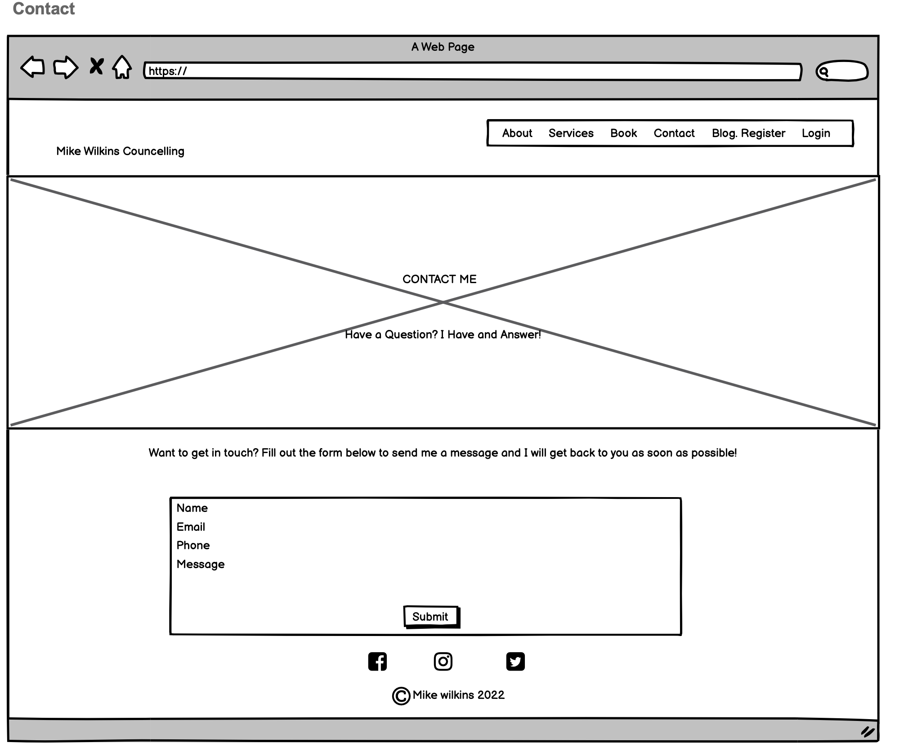
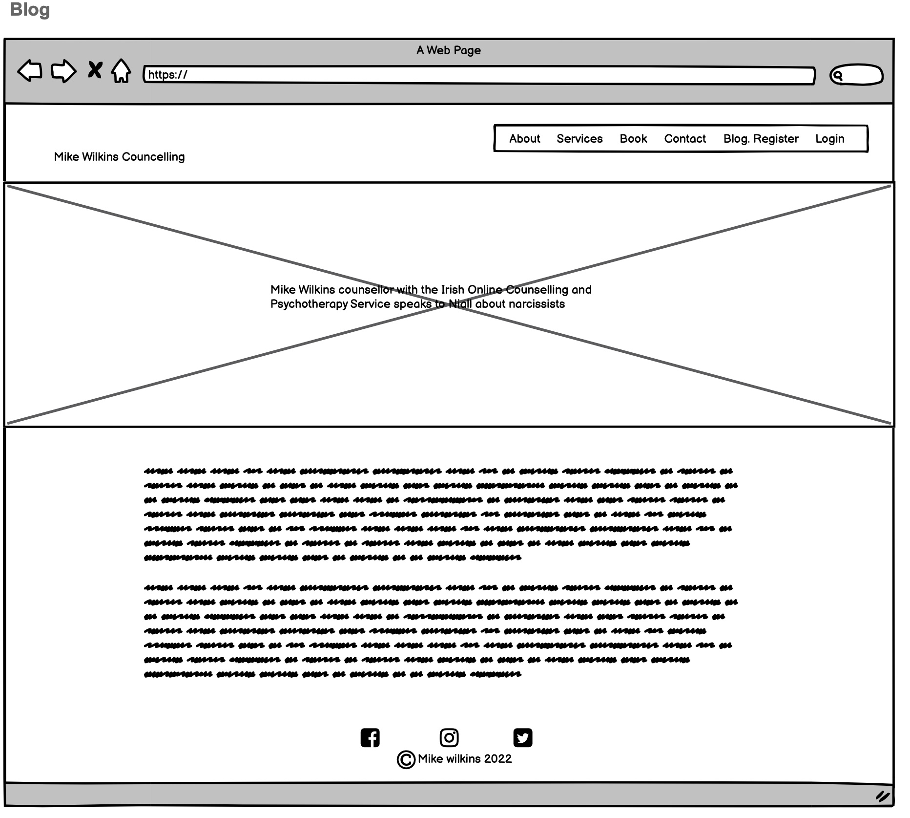

# Councelling Appointment Booking System for Mike Wilkins Councellor

This project is a fictional Website for a councellor named Mike Wilkins. People looking for a councellor can view the site on all types of devises, where they can learn more and also book, edit and cancel appointments with Mike. The site is fully responsive and accessible.

[Here is the live version link to my project]()

## Menu

* [About](#About)

* [UX](#ux)

  * User Stories
  * Design
  * Wireframes

* [Features](#features)

* [Tecnologies Used](#tecnologies_used)

* [Testing](#testing)

* [Deployment](#deployment)

* [Credits](#credits)

# About

Mike Wilkins Councelling is a fictional website for a Councellor. The site can be viewed on mobile, desktop, laptop and tablets. Users can view the site in the usual way by navigating through the pages to learn more about the business. Users can view the Home, About, Services, Contact and Blog pages. The blog has not been set up yet so the users can sign up for an email for when it will be live. As well as this the User is able to create an account and then book, edit or delete appointments with the councellor. The User cannot use this service unless they have signed up for an account. Once signed in the User can view all their appointments using the My appointments link that appears in the nav bar. Site Admin Users can also create, edit and delete bookings in the Admin panel.

# UX
  ## User stories
  ### Site User Stories
  1. As a site user I can understand the purpose of the site so that I can learn more about the business with ease.
  2. As a site user I can easily navigate the site so that I can find what I'm looking for.
  3. As a site user I can sign up for an accountso that I can make a booking with the counsellor.
  4. As a site user I can sign into my account so that I can view and change my appointment details.
  5. As a site user I can sign out of my account so that I can keep my details safe.
  6. As a site user I can send a message to the counsellor so that I can learn more about the counsellor and the benefits of therapy.
  ### Administration User Stories
  1. As a site administrator I can create, view, change and delete bookings so that I have control over my appointment system.

  ## Design
  The site is designed with five pages - Home, About, Contact, Book, Services and Blog. There are links  and a Nav bar provided  to connect to other parts of the site. Each page is fully responsive.
  
  I used the greyscale bootstrap theme from [Startbootstrap](http://startbootstrap.com/) and modified it to suit my ideas
  
  The main fonts used are Nunito, and Varela Round and the main colours are grey, green, black and white.

  ## Wireframes
  Below are the wireframes that I created using [Balsamiq](https://balsamiq.com/)

  ### Home Page
  

  ### About Page
  

  ### Services Page
  

  ### Book Page
  

  ### Contact Page
  

  ### Blog Page
  

  # Features

  The site is fully responsive by using the Bootstrap Greyscale Theme. All features get resized correctly except for the appointment table in view_appointment.html when viewed on a mobile. However one is able to slide across to view and also tilt the device to look in landcape mode.

  The site is easy to navigate by using the navbar.

  ## Future Features
   1. Email sent to user when booked, edited or deleted appointment.
   2. Email sent to user when asked councellor a question in the contact form to say he'll be in touch.
   3. Set up interactive blog app with information about mental health issues.

